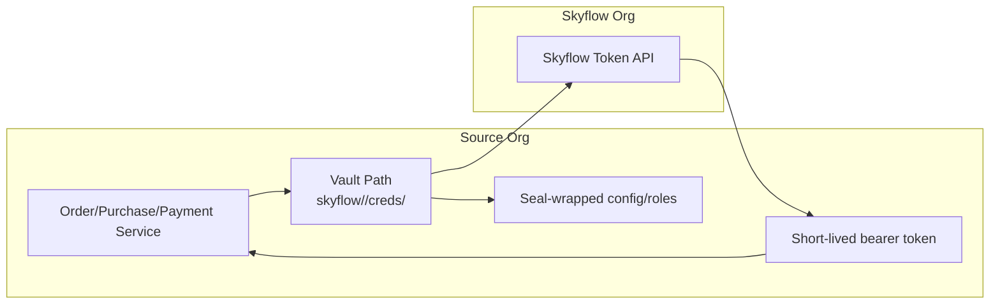

# vault-plugin-secrets-skyflow

Custom Vault secrets plugin that exchanges scoped Skyflow tokens on behalf of downstream services. The plugin is modeled after first-party integrations such as [AWS auth](https://developer.hashicorp.com/vault/api-docs/auth/aws) and [LDAP secrets](https://developer.hashicorp.com/vault/docs/secrets/ldap), enabling operators to mount multiple instances (order, purchase, payment) with isolated credentials and policies.

## Highlights

- Vault-native experience: mount anywhere under `skyflow/*`, managed via standard `vault secrets` commands.
- Seal-wrapped storage for Skyflow service accounts and per-role metadata.
- Short-lived bearer tokens emitted through `/creds/{role}` paths with optional request context.
- Built-in telemetry hooks (OTLP) and health checks for safe rollout across environments.

## Skyflow

Skyflow provides a hosted data privacy vault that tokenizes and stores sensitive records (PII, payments, healthcare data) while exposing secure APIs for retrieval under strict governance. Organizations onboard to Skyflow when they want:

- Centralized tokenization instead of bespoke encryption spread across services.
- Policy-driven access for regulated domains such as order processing, purchase orchestration, or payment settlement.
- Regional data residency controls with built-in auditability and masking.

This plugin extends Vault so platform teams can keep using familiar Vault workflows while delegating actual data protection and token issuance to Skyflow.

### PII Regulations & Compliance Drivers

- GDPR/CCPA mandates for minimizing access to personal data while maintaining auditability.
- PCI DSS requirements for isolating payment tokens from application stacks.
- HIPAA or healthcare-specific obligations demanding fine-grained controls and breach reporting.
- Data residency rules that force sensitive records to stay within specific regions (EU, APAC, etc.).

## Why Use Skyflow

### Application Drivers

- Deliver consistent tokenization and masking for order, purchase, and payment data without re-implementing crypto.
- Enforce policy-driven access controls that align with GDPR, PCI, HIPAA, and other regulatory frameworks.
- Centralize PII storage with regional residency guarantees while keeping application stacks lightweight.
- Provide platform teams a managed privacy service that integrates with existing Vault-based workflows.

### Existing Pain Points

- Each application needs Skyflow credentials, creating duplication and risk when dozens of services store JSON keys.
- Rotating Skyflow service accounts across multiple codebases takes days and often requires coordinated redeployments.
- Security teams lack a single audit trail for who requested which Skyflow token and why.
- Developers must learn Skyflow APIs even when they already rely on Vault for other secrets.
- Incident response is slow because revoking a compromised credential means touching every consumer individually.

## Overview

Applications call Vault, Vault calls Skyflow, and Skyflow returns scoped access tokens. The plugin sits between your services and Skyflow so individual teams never handle long-lived credentials.



### Benefits

- **Credential abstraction**: Vault owns the Skyflow service account JSON, so dozens of applications can request tokens without ever storing raw credentials.
- **Central onboarding**: Each product line (order, purchase, payment, etc.) gets an isolated mount where operators upload the Skyflow JSON once and define roles per application.
- **Silent rotation**: Operators can rotate Skyflow credentials at the mount level without any application redeployments, giving security teams auditable, low-risk key rotation.
- **Consistent auditing**: All `/creds/{role}` calls flow through Vault policies and audit logs, making compliance reviews straightforward.
- **Fast incident response**: If a credential is compromised, deleting or rotating the mount config immediately cuts off every consumer, avoiding app-by-app fixes.
- **Ready for catalog submission**: Mirrors other HashiCorp integrations, simplifying review by the Vault integrations team.

## Multi-Vault Layout

Multiple mounts keep Skyflow credentials segmented per product domain while sharing the same plugin binary. Operators can rotate or revoke one mount without touching the others.

```
vault/
├─ skyflow/order/     # Order orchestration mount
│  ├─ config          # Skyflow credentials for order platform
│  └─ roles/          # Producer/consumer roles per integration
│      ├─ order-producer
│      └─ order-consumer-*
│
├─ skyflow/purchase/  # Purchase workflow mount
│  ├─ config
│  └─ roles/
│      ├─ purchase-producer
│      └─ purchase-consumer-*
│
└─ skyflow/payment/   # Payment services mount
   ├─ config
   └─ roles/
	   ├─ payment-producer
	   └─ payment-consumer-*
```

## Prerequisites

| Dependency | Requirement |
|------------|-------------|
| Vault server | 1.16+ with plugin framework enabled |
| Skyflow account | Service user capable of minting role-based tokens |
| Compiled plugin binary | e.g., `bin/skyflow-plugin` built from this repo or CI artifacts |

## Using the Plugin

### 1. Register and Enable

```bash
SHA=$(sha256sum bin/skyflow-plugin | cut -d' ' -f1)
vault plugin register -sha256=$SHA -command=skyflow-plugin secret skyflow-plugin
vault secrets enable -path=skyflow/order skyflow-plugin
```

Repeat the `vault secrets enable` step for other product mounts such as `skyflow/purchase` or `skyflow/payment`.

### 2. Onboard Skyflow Credentials

Store the Skyflow service account JSON for the mount. This happens once per product line and the data remains seal-wrapped inside Vault.

```bash
vault write skyflow/order/config \
	credentials_file_path="/etc/vault/creds/order-service.json" \
	description="Order platform Skyflow credentials"
```

### 3. Create Roles for Applications

Each application maps to a Skyflow role ID. Vault keeps these definitions, so onboarding a new service is just another `vault write`.

```bash
vault write skyflow/order/roles/order-producer \
	role_ids="skyflow-role-order-prod" \
	description="Order service writer"

vault write skyflow/purchase/roles/purchase-consumer-portal \
	role_ids="skyflow-role-purchase-read" \
	description="Portal consumes purchase tokens"
```

### 4. Fetch Tokens via Vault

Applications request `/creds/{role}`. Vault looks up the role, reads the stored Skyflow JSON, exchanges it for a bearer token, and returns the response. Optional `ctx` strings help trace individual operations.

```bash
vault read skyflow/order/creds/order-producer ctx="order:ORD-42"
vault read skyflow/payment/creds/payment-risk-engine ctx="txn:PAY-8831"
```

Tokens are short-lived, so services can safely request them on demand without handling long-lived secrets.

## Documentation

| Topic | Location |
|-------|----------|
| Architecture overview | [docs/architecture.md](docs/architecture.md) |
| API & testing guidelines | [docs/guidelines.md](docs/guidelines.md) |
| CI/CD & operations playbook | [docs/sre-guide.md](docs/sre-guide.md) |