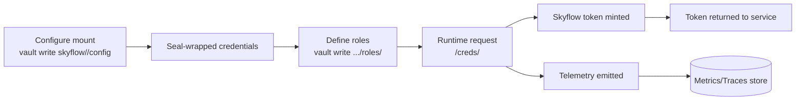

# Architecture

This document describes the structural design of the Skyflow Vault secrets plugin. It explains how the plugin fits into the overall platform, the runtime topology, and the major components that make up the system. Detailed API behaviors, test plans, and CI/CD workflows are documented elsewhere.

## Runtime Topology

```
┌────────────────┐      ┌─────────────────────┐      ┌────────────────┐
│ Order Service  │ ───▶ │  Vault (Plugin)     │ ───▶ │ Skyflow Vault  │
│ Purchase App   │     │  skyflow/<mount>/... │     │ Token Service  │
│ Payment Engine │     │                     │     │                │
└────────────────┘      └─────────────────────┘      └────────────────┘
           │                        │
           │                        ▼
           │             ┌─────────────────────┐
           │             │ Vault Storage       │
           │             │ (seal-wrapped data) │
           │             │  • config           │
           │             │  • roles/*          │
           │             └─────────────────────┘
           ▼
   Observability Stack (metrics, traces, logs)
```

   ### Token Request Sequence

   ```mermaid
   sequenceDiagram
      participant App as Service (order/purchase/payment)
      participant Vault as Vault Plugin
      participant Storage as Vault Storage (seal-wrapped)
      participant Skyflow as Skyflow Token API

      App->>Vault: GET skyflow/<mount>/creds/<role> (ctx)
      Vault->>Storage: Load mount config (credentials)
      Storage-->>Vault: Skyflow SA JSON
      Vault->>Storage: Load role definition
      Storage-->>Vault: role_id metadata
      Vault->>Skyflow: Exchange credentials + role_id
      Skyflow-->>Vault: Short-lived access token
      Vault-->>App: access_token + token_type
      Note over Vault,Skyflow: Emit metrics/traces when enabled
   ```

### Key Ideas

- The plugin is a tightly scoped Vault backend that converts Vault requests into Skyflow token operations.
- All sensitive configuration stays inside Vault storage and is automatically seal-wrapped; the plugin never persists data outside of Vault.
- The runtime depends only on the Vault SDK and the Skyflow client, keeping the plugin stateless between requests aside from Vault storage reads/writes.

## Mount Isolation Model

Organizations can deploy multiple mounts to isolate credentials for major product domains such as order management, purchase orchestration, or payment processing. Each mount path owns its configuration and roles.

```
vault/
├─ skyflow/order/     # Order orchestration mount
│  ├─ config          # Skyflow credentials for order platform
│  └─ roles/          # Producer/consumer roles per integration
│      ├─ order-producer
│      └─ order-consumer-*
│
├─ skyflow/purchase/  # Purchase workflow mount
│  ├─ config
│  └─ roles/
│      ├─ purchase-producer
│      └─ purchase-consumer-*
│
└─ skyflow/payment/   # Payment services mount
   ├─ config
   └─ roles/
       ├─ payment-producer
       └─ payment-consumer-*
```

This multi-mount approach keeps blast radius small: disabling or rotating credentials for one product line never impacts the others.

## Component Overview

| Path | Responsibility |
|------|----------------|
| `cmd/main.go` | Entry point that registers the plugin with Vault and starts the server. |
| `backend/backend.go` | Composes the Vault backend, registers paths, and wires telemetry. |
| `backend/config.go` | Data structures for static Skyflow credentials plus validation helpers. |
| `backend/role.go` | Defines per-role metadata and enforces invariants (single `role_id`, tags, etc.). |
| `backend/path_*.go` | Concrete path handlers for config, health, roles, and token generation. |
| `backend/telemetry/` | Emits metrics/traces and controls the opt-in/out logic. |

Each handler focuses on translating Vault requests into backend operations, deferring persistence to Vault's logical storage and isolation rules.

## Data Lifecycle

1. **Configuration** — Operators write credentials per mount. The plugin validates and stores them seal-wrapped.
2. **Role definition** — Roles map business use-cases (order producer, payment consumer) to Skyflow role IDs, stored under `roles/<name>`.
3. **Request execution** — Runtime requests resolve config + role data, call Skyflow to mint tokens, and return short-lived credentials to the caller.
4. **Observability** — Each significant operation emits metrics and traces with attributes such as mount path, role, and calling application, enabling SRE teams to watch usage patterns per product line.



## Resilience Considerations

- **Stateless workers**: Multiple Vault nodes can host the plugin; Vault handles request fan-out and storage replication.
- **Backpressure and retries**: Vault's plugin framework supplies context deadlines, so handlers honor cancellation when Skyflow APIs degrade.
- **Least privilege**: Every mount uses a distinct service account credential, preventing lateral movement if one is compromised.
- **Telemetry guardrails**: Environment variables allow operators to disable telemetry entirely in sensitive or air-gapped environments without rebuilding the plugin.

This architectural separation lets platform teams scale the plugin alongside their product portfolios while keeping per-domain credentials and telemetry isolated.